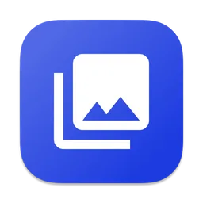
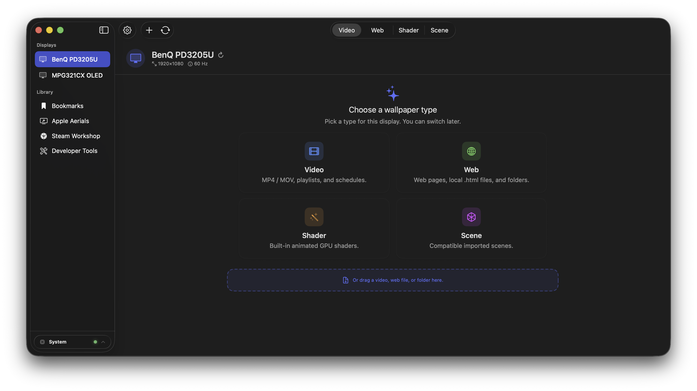
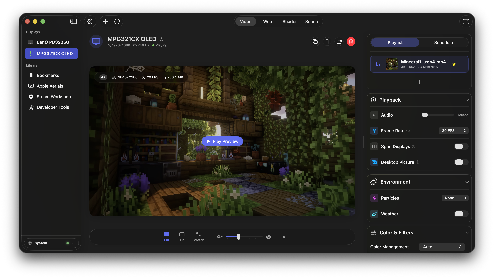
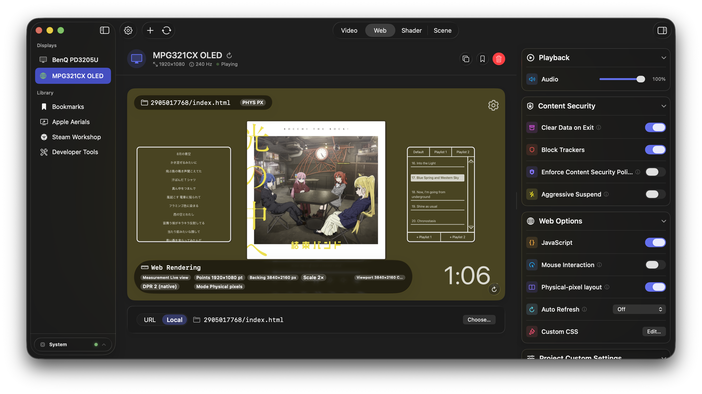
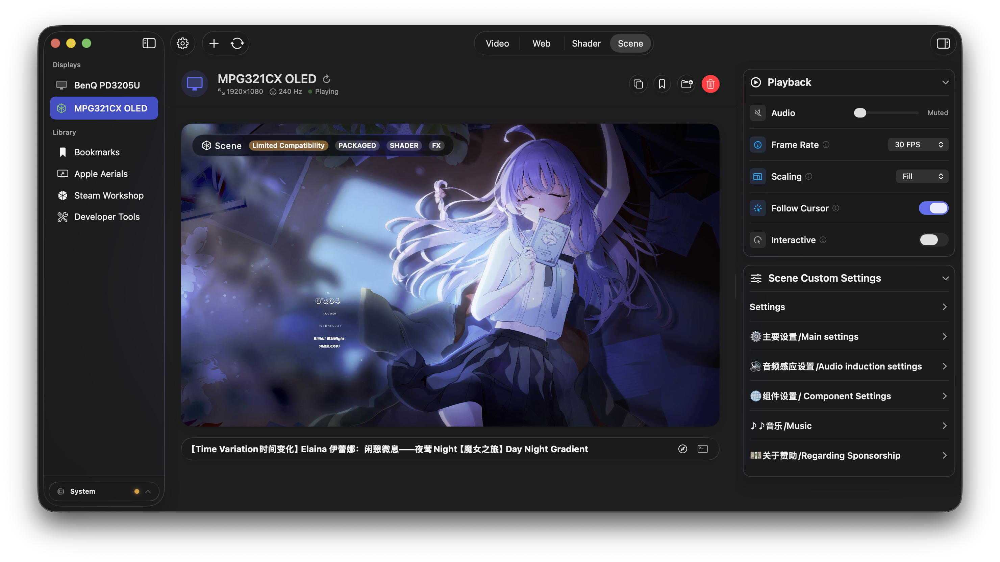
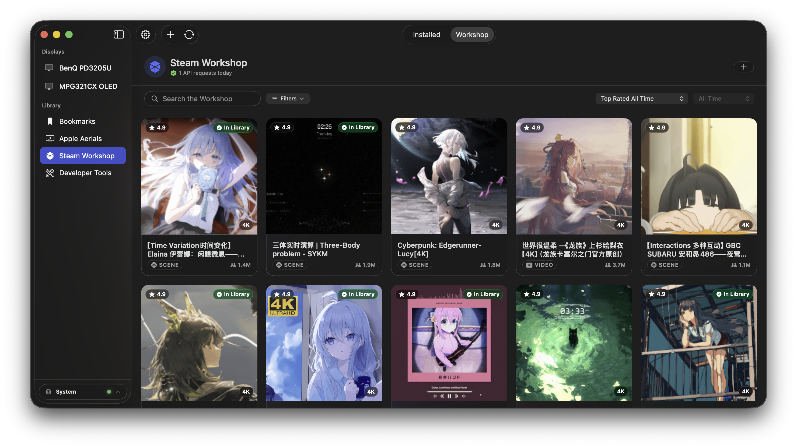

# Loomscreen

<div align="center">



### macOS 动态壁纸助手：视频、网页、着色器、Wallpaper Engine 场景，多显示器统一管理。


[⬇ 下载](https://github.com/Paradox07127/Loomscreen/releases/latest) ·
[🧭 文档](docs/README.md) ·
[✨ 功能](docs/features.md) ·
[⚖ Lite vs Pro](docs/lite-vs-pro.md) ·
[🛠 Build](docs/building.md) ·
[🎬 Screenshots](docs/screenshots.md) ·
[🇬🇧 English](README.md)

</div>

Loomscreen 是一个以菜单栏为入口的 macOS 动态桌面应用。你可以按显示器独立配置来源、保存常用配置，并在菜单栏快速切换。支持本地视频、网页、Apple Aerials（Lite）；Pro 额外支持 Metal 着色器和 Wallpaper Engine 场景。



## 能做什么

- **每块显示器独立管理**：为每个显示器设置不同来源，可一键同步到所有屏幕。
- **多种来源**：
  - 本地**视频**（循环播放、跨屏可平滑渲染）
  - 本地/本地文件夹**网页**
  - 本地**Apple Aerials**（系统已下载的航拍视频）
  - **着色器**（`.lwshader` / `.metal`）与 **Wallpaper Engine 场景**（Pro）
- **播放控制体系**：播放列表、时间段排程、随机播放、前进/后退、全局暂停。
- **可视化参数**：音量、帧率、拉伸模式、光标跟随、粒子、色彩、天气联动效果。
- **菜单栏快捷入口**：一键添加、全局开关、播放步进、系统 CPU/GPU/RAM/TEMP 指标。
- **收藏与迁移**：书签库、配置导入导出。
- **省电友好**：全屏/窗口遮挡/电池模式自动降速暂停。
- **不采集使用数据**：不需要账号、不做行为上报。

## 版本划分

| 版本 | 能力 |
|---|---|
| **Loomscreen Lite** | 视频 / 网页 / Apple Aerials、播放列表、排程、书签、快捷键、天气联动、性能控制。 |
| **Loomscreen Pro** | 在 Lite 基础上新增：Metal 着色器、Wallpaper Engine 场景、场景导入、Steam Workshop（在线浏览/下载，需直发版）、开发者工具。 |

### 场景化截图

- 视频壁纸配置：



- 网页壁纸配置：



- 场景/Shader（Pro）：



- Workshop（Pro）：



完整对照见 [docs/lite-vs-pro.md](docs/lite-vs-pro.md)。  
实现说明：Lite 通过 `#if LITE_BUILD` 去掉重型渲染器，UI 并未“缩水”。

## 快速开始

### 1）安装

1. 从 [Releases](https://github.com/Paradox07127/Loomscreen/releases/latest) 下载最新 `Loomscreen-x.y.z.dmg`。
2. 拖拽 `Loomscreen.app` 到 `/Applications`。
3. 首次运行前执行一次：
   ```bash
   xattr -dr com.apple.quarantine /Applications/Loomscreen.app
   ```
4. 启动后在菜单栏图标继续完成初始化流程。

### 2）首次引导

- 首次启动会弹出向导，选择第一份壁纸来源后可直接进入主界面。
- 之后在设置窗口进入对应显示器继续调参。

### 3）每屏配置

- 在 **设置 → Displays** 选择目标显示器。
- 选择壁纸类型（Video / Web / Shader / Scene，Lite 会自动隐藏不可用类型）。
- 打开预览选择源文件/文件夹。
- 在右侧属性区调整音量、帧率、颜色/粒子/天气等参数。

### 4）文档索引

- [docs/README.md](docs/README.md) — 文档主入口与导航。
- [docs/features.md](docs/features.md) — 功能清单与界面实现映射。
- [docs/install.md](docs/install.md) — 安装、更新与首次运行说明。
- [docs/quick-start.md](docs/quick-start.md) — 完整首次配置流程。
- [docs/troubleshooting.md](docs/troubleshooting.md) — 常见故障和排查步骤。
- [docs/screenshots.md](docs/screenshots.md) — 截图命名与采集清单。

## 更新方式

- 启动时自动检查一次更新（12 小时限流）；在 **设置 → About** 可以手动检查并可跳过版本。
- 升级采用手动下载 DMG、替换应用、重复 `xattr` 的方式。

## 运行要求

- macOS 14.0+
- Apple Silicon（不支持 Intel）

## 从源码

```bash
git clone https://github.com/Paradox07127/Loomscreen.git
cd LiveWallpaper
open LiveWallpaper.xcodeproj
```

- Scheme：`LiveWallpaperLite`（轻量版）或 `LiveWallpaper`（Pro）。

构建细节请看 [docs/building.md](docs/building.md)。

## 贡献 / 安全 / 许可

- 欢迎提交 Issue/PR。建议在本地通过相应构建与测试流程确认改动。
- 安全问题请用 GitHub Security Advisories 提交。
- 许可协议：MIT（`LICENSE`），含 Pro-only 模块。

> Loomscreen 不会内置也不会替你绕过 Wallpaper Engine 的授权资产；你需要对导入内容本身的授权负责。
