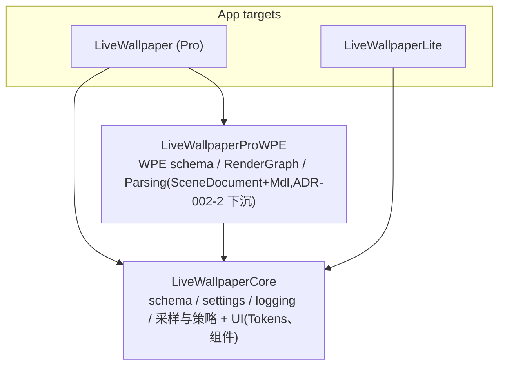

# SPM 包依赖图(C4 Container 层)

自 `Packages/*/Package.swift` 与 `project.pbxproj` 实测生成(2026-07-22)。
**维护约定:任何包依赖或 target 链接变更,同一 commit 内更新本图。** 无环性由
`WallpaperArchitectureTests`(ADR-002 fitness)与 SPM 本身共同保证;本图把"已核实 DAG
无环"的结论固化为可 diff 的文档。

## 建包判据

**只有"必须在 Lite 二进制里不存在"的代码才拆包。** 其余一律留在 app target 或并入 Core。

按这条判据,只剩两个包:

- **ProWPE** —— 唯一的 SKU 承重墙,**仅 Pro target 链接**(pbxproj 实测 productName 计数:ProWPE ×1,Core ×2)。
- **Core** —— 不是自身够格,而是 **SPM 包不能依赖 app target 代码**:ProWPE 要成为包,它的底座就被迫也得是包。
  Core 内的 `UI/` 子目录(Tokens / Components / SystemMonitor / VideoWeb)是**组织性**划分,不是层边界:
  Core 根下的 `Schema/`、`Display/` 里本来就有文件 import SwiftUI/AppKit(枚举挂 `Color`/`Image` 的惯用写法)。
  **别把 `UI/` 当"UI 层 vs 无 UI 层"的门禁——没有门禁强制它。**

> 2026-07-22 退役三个包:`ProFeatures`(SystemMonitor)、`VideoWeb`、`SharedUI`。三者都被两个 target
> 链接 ⇒ 零 SKU 隔离作用,不满足建包判据,全部并入 Core。5 包 → 2 包。
> 注意 AgentFleet **不在**任何包内,它住在 app target 的 `LiveWallpaper/Monitor/`。

## 为什么分包:是链接期强制,不是编译速度

包内代码**不能**用 `#if LITE_BUILD` —— Xcode 不把 `SWIFT_ACTIVE_COMPILATION_CONDITIONS`
下传到本地 package,写了永远是 `false`(见 `ProductCapabilities.swift` 的说明)。对包内代码,
**链接与否就是那个开关**,所以 ProWPE 那 8000+ 行一个 `#if` 都没有。

但**调用方一行都省不掉**:app target 用 Xcode 16 文件系统同步组,两个 target 自动吃同一批源文件,
所以引用 ProWPE 的 app 文件必须整文件 `#if !LITE_BUILD` 包起来(实测 85/85 全包了)。

分包真正买到的不是 `#if` 数量,而是**忘写 `#if` 时的后果**:漏包裹会让 Lite 报
`Unable to resolve module dependency: 'LiveWallpaperProWPE'` 直接编译失败,而不是把 Pro 代码
静默塞进 Lite 二进制。**约定变成了编译器强制的不变式。** 但这层保护只覆盖真正住在 ProWPE 里的符号;
仍留在 app target 的 Workshop / SteamCMD 等 Pro 代码依旧只靠 `#if` 约定。

## 方向红线

- ADR-002:app 巨石可依赖包,包**永不**引用 app 类型;`Infrastructure/` 不得引用 `Runtime/` 类型(fitness 测试有牙)。
- 禁止 `@_exported import` 再导出伞:`scripts/check_module_import_boundaries.py` 会拒绝任何新增项。
