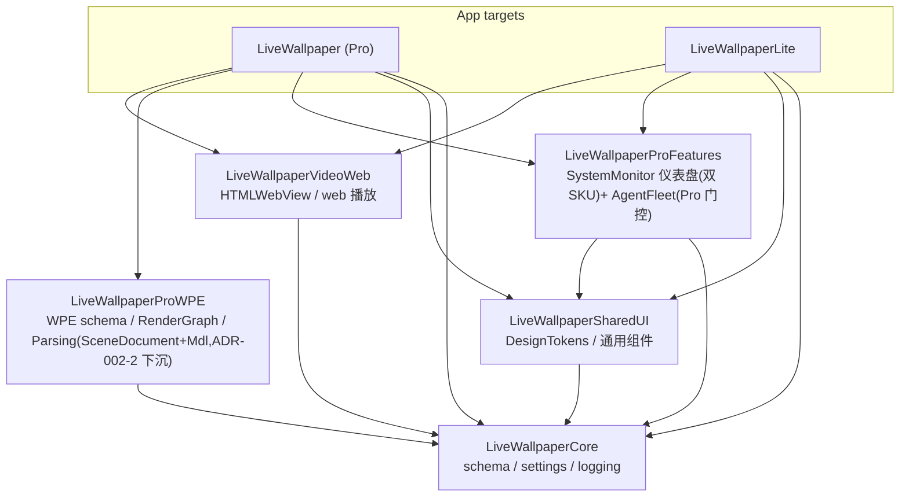

# SPM 包依赖图(C4 Container 层)

自 `Packages/*/Package.swift` 与 `project.pbxproj` 实测生成(2026-07-06,review breadth#6)。
**维护约定:任何包依赖或 target 链接变更,同一 commit 内更新本图。** 无环性由
`WallpaperArchitectureTests`(ADR-002 fitness)与 SPM 本身共同保证;本图把"已核实 DAG
无环"的结论固化为可 diff 的文档。

要点:

- **LiveWallpaperCore 是唯一根依赖**,自身零包依赖;所有包只允许依赖 Core(ProFeatures 额外依赖 SharedUI)。
- **LiveWallpaperProWPE 仅 Pro target 链接**(pbxproj 实测 productName 计数:ProWPE ×1,其余四包 ×2)——Lite 的 WPE 隔离靠"不链接包 + app 侧 `#if !LITE_BUILD`"双保险。
- ProFeatures 双 target 链接:系统监控仪表盘是双 SKU 一等公民,AgentFleet 模块在包内按 Pro capability 门控(H10 正例,勿误判为 Lite 阉割)。
- 方向红线(ADR-002):app 巨石可依赖包,包**永不**引用 app 类型;`Infrastructure/` 不得引用 `Runtime/` 类型(fitness 测试有牙)。
